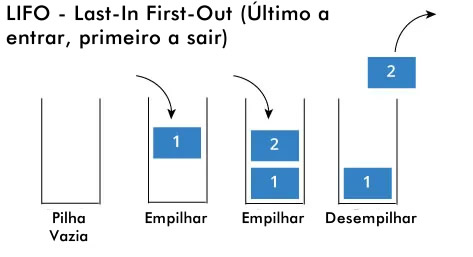

# Pilhas em JAVA

> Pilha

🔋 Projeto criado para atividade acadêmica 🔋

[🔗 Clique aqui para acessar.](https://danielkistemacher.github.io/Pilha-Java/)

## 🛠 Tecnologias
- Java  
- Git e GitHub

## ⚠ Informações do projeto

- Inserir: o elemento sempre será inserido no "topo" da pilha.  
- Remover: sempre será removido o elemento que está no topo (último a entrar). 
- Métodos para inserir, remover e imprimir elementos de uma pilha.  
 

## ✉ Contato
danielkistemacher@gmail.com